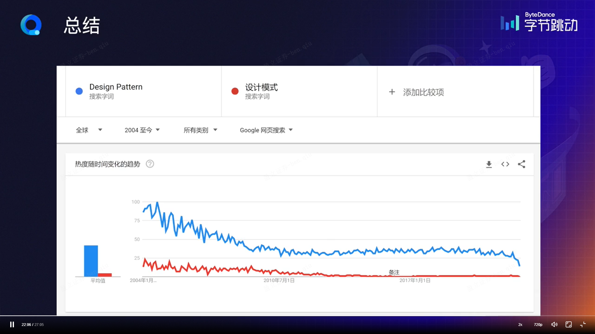
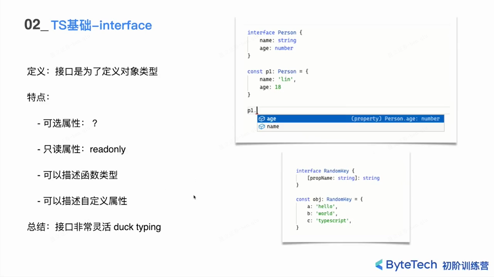

## 待看视频

> （按优先级高到低依次排序）

- [x] [前端设计模式概述 - 掘金](https://juejin.cn/course/bytetech/7169405808147431455/section/7169465286075088932)
- [x] [JavaScript 和前端框架中的设计模式 - 掘金](https://juejin.cn/course/bytetech/7169405808147431455/section/7169471877549654023)
  - [x] [【前端专场 学习资料二】字节跳动青训营 - 掘金](https://juejin.cn/post/7189162833613963325#heading-13)

- [ ] [深入浅出 TypeScript - 掘金](https://juejin.cn/course/bytetech/7219155491984212024/section/7223915114905698362)
- [ ] [React 的历史与应用 - 掘金](https://juejin.cn/course/bytetech/7180922988034785336/section/7181287649443840061)
- [ ] [React 的设计思路 - 掘金](https://juejin.cn/course/bytetech/7180922988034785336/section/7181297907503464509)
- [ ] [React (hooks)的写法与 React 实现 - 掘金](https://juejin.cn/course/bytetech/7180922988034785336/section/7181298684229845053)
- [ ] [React 状态管理库与应用级框架科普 - 掘金](https://juejin.cn/course/bytetech/7180922988034785336/section/7181301644058067001)
  - [x] [【前端专场 学习资料二】字节跳动青训营 - 掘金](https://juejin.cn/post/7189162833613963325#heading-13)
- [ ] [Webpack 定义解析 - 掘金](https://juejin.cn/course/bytetech/7180922988034785336/section/7181287647778701369)
- [ ] [Webpack 使用方法 - 掘金](https://juejin.cn/course/bytetech/7180922988034785336/section/7181301869854064701)
  - [x] [【前端专场 学习资料五】字节跳动青训营 - 掘金](https://juejin.cn/post/7196393365314322489/#heading-0)
- [ ] [前端开发调试之 PC 端调试 - 掘金](https://juejin.cn/course/bytetech/7180922988034785336/section/7181029728822755385)
- [ ] [前端开发调试之移动端调试 - 掘金](https://juejin.cn/course/bytetech/7180922988034785336/section/7181053070262943804)
  - [x] [【前端专场 学习资料四】字节跳动青训营 - 掘金](https://juejin.cn/post/7194380955958640695/#heading-4)
- [ ] [Vite 基本概要 - 掘金](https://juejin.cn/course/bytetech/7180922988034785336/section/7181337230214955063)
- [ ] [Vite 上手实战与架构解析 - 掘金](https://juejin.cn/course/bytetech/7180922988034785336/section/7181336006816170021)
- [ ] [Vite 进阶路线 - 掘金](https://juejin.cn/course/bytetech/7180922988034785336/section/7181337621052784697)
  - [x] [【前端专场 学习资料五】字节跳动青训营 - 掘金](https://juejin.cn/post/7196393365314322489/#heading-0)
- [ ] [Web 开发基本情况介绍 - 掘金](https://juejin.cn/course/bytetech/7169405808147431455/section/7168760826797817863)
- [ ] [Web 开发标准 - 掘金](https://juejin.cn/course/bytetech/7169405808147431455/section/7169425175421812749)
  - [x] [【前端专场 学习资料二】字节跳动青训营 - 掘金](https://juejin.cn/post/7189162833613963325#heading-13)
- [ ] [初识 HTTP 协议 - 掘金](https://juejin.cn/course/bytetech/7169405808147431455/section/7169430296574558216)
- [ ] [HTTP 协议的应用场景分析 - 掘金](https://juejin.cn/course/bytetech/7169405808147431455/section/7169464204594937893)
- [ ] [HTTP 协议实战分析 - 掘金](https://juejin.cn/course/bytetech/7169405808147431455/section/7168791819554127908)
  - [x] [【前端专场 学习资料二】字节跳动青训营 - 掘金](https://juejin.cn/post/7189162833613963325#heading-13)
- [ ] [深入CSS (上) - 掘金](https://juejin.cn/course/bytetech/7145675320224383006/section/7145664469740290085)
- [ ] [深入CSS (下) - 掘金](https://juejin.cn/course/bytetech/7145675320224383006/section/7145672737242120206)
- [ ] [前端与 HTML - 掘金](https://juejin.cn/course/bytetech/7145675320224383006/section/7145427918028537892)
  - [x] [【前端专场 学习资料一】字节跳动青训营 - 掘金](https://juejin.cn/post/7188270306593603639#heading-0)
- [ ] [JavaScript 编码原则之各司其责 - 掘金](https://juejin.cn/course/bytetech/7145675320224383006/section/7145464663537352717)
- [ ] [JavaScript 编码原则之组件封装 - 掘金](https://juejin.cn/course/bytetech/7145675320224383006/section/7145717063451934728)
- [ ] [JavaScript 编码原则之过程抽象 - 掘金](https://juejin.cn/course/bytetech/7145675320224383006/section/7145464663549935652)
- [ ] [JavaScript 代码质量优化之路 - 掘金](https://juejin.cn/course/bytetech/7145675320224383006/section/7145718062635810829)
  - [x] [【前端专场 学习资料一】字节跳动青训营 - 掘金](https://juejin.cn/post/7188270306593603639#heading-0)
- [ ] [Web 开发安全 - 攻击篇 - 掘金](https://juejin.cn/course/bytetech/7169405808147431455/section/7169430298457800717)
- [ ] [Web 开发安全 - 防御篇 - 掘金](https://juejin.cn/course/bytetech/7169405808147431455/section/7169466760435859487)
  - [x] [【前端专场 学习资料四】字节跳动青训营 - 掘金](https://juejin.cn/post/7194380955958640695/#heading-4)

---

- [x] 希望学新知识能想学历史一样，听着作者娓娓道来，因...而起，解决了...问题，迭代的原因及过程，同比竞争者有何优势，自身优缺点

# [彻底了解npm——架构、进化史及原理解析](https://juejin.cn/post/7245201923506094140?searchId=20230725213536392558E1A4B81F242684#heading-0)

## SemVer 机制

SemVer（Semantic Versioning）是一种软件版本控制规范，旨在为软件库的版本号提供一致和易于理解的命名约定。这个规范允许开发者和用户快速了解一个软件版本中包含的变化和兼容性信息，以便更好地管理依赖关系和升级决策。

SemVer 的版本号由三个数字组成：`MAJOR.MINOR.PATCH`，如 `2.1.3`。每个数字表示了不同级别的变化：

\1. `MAJOR`（主版本号）：当进行不向后兼容的 API 变更或重大功能改进时，增加主版本号。这意味着旧版本与新版本之间可能存在不兼容的变化。

\2. `MINOR`（次版本号）：当添加向后兼容的新功能时，增加次版本号。这意味着新版本向下兼容旧版本，但可能引入了新的功能或改进。

\3. `PATCH`（补丁版本号）：当进行向后兼容的错误修复或小改动时，增加补丁版本号。这意味着新版本修复了旧版本中的问题，但没有引入新的功能。

按照 SemVer 规范，版本号的递增遵循以下原则：

\- 任何版本初始号都是 `0.1.0`，即第一个公开版本的 `MINOR` 号为 1，`PATCH` 号为 0。
\- 当主版本号增加时，次版本号和补丁版本号都会归零。
\- 当次版本号增加时，补丁版本号归零。
\- 当进行错误修复或补丁时，增加补丁版本号。

举个例子：

\- 从 `1.2.3` 到 `1.3.0`：添加了新功能，向后兼容。
\- 从 `1.2.3` 到 `2.0.0`：进行了不向后兼容的更改，主版本号增加。
\- 从 `1.2.3` 到 `1.2.4`：进行了向后兼容的错误修复，补丁版本号增加。

SemVer 的规范使得软件版本控制更加清晰和可预测，帮助开发者和用户更好地理解软件库的变化和演进。在开发和发布软件时，遵循 SemVer 可以使依赖管理更加可靠，减少意外的兼容性问题，以及使软件升级过程更加可控。

​	

## 依赖不幂等问题

依赖不幂等性问题是指在计算或处理过程中，对于相同输入的依赖操作，在不同的执行过程中可能会产生不同的结果。在幂等性的场景中，多次执行相同的操作不会改变最终的结果，而在不幂等性的场景中，多次执行相同的操作可能会导致不一致的结果。

在计算机科学和分布式系统中，依赖不幂等性可能会导致一系列问题，例如：

1. **并发冲突：** 当多个并发操作对同一个资源进行读写时，由于依赖不幂等性，可能会产生冲突，导致数据的不一致性或错误的结果。

2. **重试问题：** 当依赖操作不是幂等的时候，在进行失败重试时可能会导致重复执行相同的操作，进而可能产生额外的副作用或错误。

3. **事务问题：** 在数据库事务或分布式系统中，如果依赖操作不是幂等的，当事务回滚并重试时，可能会导致不一致的状态。

4. **网络和消息传递：** 在网络通信或消息传递中，由于网络故障或消息丢失，可能会导致依赖操作被重复执行，从而造成数据错误或资源浪费。

解决依赖不幂等性问题的常见方法包括：

- **幂等操作设计：** 在系统设计中，尽量将依赖操作设计成幂等的，使得多次执行相同操作不会改变结果。

- **唯一标识符：** 在请求中使用唯一标识符或请求ID，以避免相同的请求被重复执行。

- **版本控制：** 对于资源的修改操作，使用乐观并发控制或版本控制，确保对于并发修改的情况下，只有最后的修改生效。

- **幂等性检查：** 在执行依赖操作之前，进行幂等性检查，判断该操作是否已经被执行过，如果已经执行，则可以跳过重复操作。

保持依赖操作的幂等性对于系统的正确性和稳定性非常重要，特别是在分布式系统和并发操作的场景中。通过合理的设计和处理，可以有效地解决依赖不幂等性问题，提高系统的可靠性和一致性。

​	

## 机制和策略

在计算机科学和工程领域中，“机制”通常指的是一种操作或过程的实现方法、手段或技术。换句话说，机制描述了如何完成某个功能或目标的具体步骤和规则。

机制和策略是两个重要的概念，它们经常在复杂系统设计和解决问题的过程中一起使用。下面简要介绍一下这两个概念的区别：

1. **机制（Mechanism）：** 机制指的是如何执行、实现或达成某个目标的具体方法和手段。机制是系统中的基础组成部分，它决定了系统的结构和行为。在软件和硬件设计中，机制通常是指具体的算法、数据结构、协议、接口等。机制属于系统的实际实现，与具体的技术和工具密切相关。

2. **策略（Strategy）：** 策略指的是为了实现目标而选择的方案或方法。策略是高层次的决策和规划，它决定了系统的整体设计和运行方式。在软件和管理领域，策略通常是指设计模式、架构、流程规则等。策略与机制相互配合，通过合理的策略来使用具体的机制来达成目标。

总体而言，机制解决了“如何做”的问题，而策略解决了“为什么这样做”的问题。在设计复杂系统时，机制和策略的选择都是关键因素，需要在整体架构的基础上进行综合考虑，以达到高效、可靠、稳健的系统设计。

​	

## Netty

Netty是一个高性能、异步事件驱动的网络应用框架，用于快速开发可伸缩的网络服务器和客户端。它是由JBOSS（现在是Red Hat）开发和维护的，最初是为了解决Java NIO（New I/O）的复杂性而设计的。Netty在众多场景下都得到了广泛应用，特别是在网络游戏、即时通讯、物联网、大数据传输、分布式系统等领域。目前已成为了Java开发者构建高性能网络应用的首选框架之一。

​	

## npm config 和 .npmrc 的区别

`npm config`和`.npmrc`都是与npm（Node Package Manager）相关的配置文件和命令，但它们有不同的作用和使用方式。

1. **npm config：**
`npm config`是用于管理npm的配置信息的命令行工具。通过`npm config`命令，您可以查看、设置、删除npm的各种配置选项，如registry（npm仓库地址）、proxy（代理设置）、prefix（全局安装路径）等。

一些常用的`npm config`命令示例：
- `npm config get registry`：查看当前npm的仓库地址。
- `npm config set registry https://registry.npm.taobao.org/`：设置npm的仓库地址为淘宝镜像。
- `npm config delete proxy`：删除已配置的代理设置。

2. **.npmrc：**
`.npmrc`是npm的配置文件，它是一个纯文本文件，位于用户的主目录下（Unix系统为`~/.npmrc`，Windows系统为`C:\Users\<username>\.npmrc`）。`.npmrc`文件用于配置npm的各种选项，如上面提到的registry、proxy等。您可以手动编辑`.npmrc`文件来自定义npm的配置，或者通过`npm config`命令来设置配置选项，npm会自动在`.npmrc`文件中保存这些配置。

`.npmrc`文件示例：
```
registry=https://registry.npmjs.org/
proxy=http://proxy.example.com:8080
```

总结：
- `npm config`是一个命令行工具，用于管理npm的配置信息。
- `.npmrc`是npm的配置文件，用于保存npm的配置选项，也可以手动编辑来自定义配置。
- 通过`npm config`命令设置的配置信息会自动保存到`.npmrc`文件中。
- 在`.npmrc`文件中设置的配置信息会在npm执行时生效，覆盖用户目录下的默认配置。

### Unix 系统是什么

Unix（通常指Unix操作系统）是一类多用户、多任务、支持多线程操作的计算机操作系统家族。它最早起源于20世纪70年代初，由肯·汤普森（Ken Thompson）和丹尼斯·里奇（Dennis Ritchie）等贝尔实验室的计算机科学家开发。

Unix操作系统的设计目标是提供一个简洁、灵活、高效、稳定且可扩展的操作系统，适用于多种硬件平台。它以C语言作为主要开发语言，这也使得Unix在不同计算机架构上易于移植。

Unix操作系统的特点和设计哲学包括：

1. **多用户：** Unix支持多用户同时登录和运行，每个用户都有自己的账户和权限管理。

2. **多任务：** Unix可以同时运行多个进程，并通过进程调度器来分配系统资源。

3. **多线程：** Unix支持多线程操作，允许进程内的多个线程并行执行。

4. **模块化设计：** Unix采用模块化的设计，将不同的功能拆分成小而简单的组件，便于扩展和维护。

5. **文件系统：** 在Unix中，一切皆为文件，包括硬件设备、网络资源等，统一使用文件接口访问。

6. **管道和重定向：** Unix引入了管道和重定向机制，允许将多个命令连接在一起进行数据流转换和处理。

7. **开放性和自由：** Unix开源且可自由使用，这也为其传播和发展做出了贡献。

Unix操作系统在学术界和工业界都取得了巨大的成功。它不仅成为了后来许多操作系统的基础，如Linux、macOS（基于Darwin，也是Unix衍生系统）、FreeBSD等，而且在服务器、超级计算机、网络设备等广泛领域得到了广泛应用。Unix的思想和设计哲学也对计算机科学的发展产生了深远的影响。

​	

# [Yeoman 创建脚手架工具](https://juejin.cn/post/6908527425462730766?searchId=20230725213755428092D3CAF51923A5D5)

## 生成器

> [迭代器和生成器 | MDN](https://developer.mozilla.org/zh-CN/docs/Web/JavaScript/Guide/Iterators_and_Generators)

生成器（Generator）是一种特殊的函数，它可以暂停执行并在需要时恢复执行。生成器的工作方式与普通函数不同，它通过`yield`关键字来产生一个序列的值，并在每次产生值后暂停执行，等待下一次调用时再继续执行。生成器的特性使得它非常适合处理大量数据或需要延迟处理的场景。

在许多编程语言中都有生成器的概念，但本文主要介绍JavaScript中的生成器，即ES6（ECMAScript 2015）引入的生成器。

在JavaScript中，可以使用`function*`关键字定义生成器函数，例如：

```javascript
function* myGenerator() {
  yield 1;
  yield 2;
  yield 3;
}
```

在上面的示例中，`myGenerator`是一个生成器函数，它使用`yield`关键字产生了三个值：1、2、3。当调用生成器函数时，它并不会立即执行，而是返回一个迭代器（Iterator）对象。

要执行生成器函数，可以使用`next()`方法调用迭代器的下一个值，例如：

```javascript
const iterator = myGenerator();
console.log(iterator.next()); // { value: 1, done: false }
console.log(iterator.next()); // { value: 2, done: false }
console.log(iterator.next()); // { value: 3, done: false }
console.log(iterator.next()); // { value: undefined, done: true }
```

每次调用`next()`方法，生成器函数都会从上一次`yield`关键字的位置开始执行，直到再次遇到下一个`yield`或函数结束为止。当生成器函数执行完毕时，`done`属性为`true`，此后再调用`next()`方法将返回一个`undefined`值。

生成器的主要优势在于它可以延迟产生数据，逐步处理大量数据而不需要一次性加载到内存中。这种特性使得生成器非常适合处理数据流、遍历复杂数据结构、处理异步操作等场景，使得代码更为简洁和高效。

​	

## ejs 模板引擎

EJS（Embedded JavaScript Templates）是一种JavaScript模板引擎，用于在Node.js和浏览器中生成动态的HTML页面。它允许开发者在HTML中嵌入JavaScript代码，从而可以动态地生成页面内容。

EJS的特点和用法包括：

1. **嵌入式JavaScript：** EJS允许在HTML页面中使用`<% %>`标签来嵌入JavaScript代码。这些标签允许你使用JavaScript的变量、循环、条件判断等功能来动态生成页面内容。

2. **模板重用：** EJS支持通过`<%- include('templateName') %>`语法来引入其他EJS模板文件，从而实现模板的重用和模块化。

3. **数据注入：** 使用EJS，你可以通过将数据传递给模板来动态地注入内容。在渲染模板时，可以将数据对象作为参数传递给EJS引擎，从而在模板中访问这些数据。

4. **客户端和服务器端都适用：** EJS既可以在Node.js服务器端使用，也可以在浏览器中使用。在服务器端，你可以使用Node.js的`ejs`包来渲染模板，在客户端，你可以使用`<script>`标签加载EJS库来动态生成页面内容。

5. **灵活性：** EJS相对于其他模板引擎来说，非常灵活。它不强制你遵循特定的文件结构或项目组织方式，允许你根据项目的需要来组织模板文件。

一个简单的EJS模板示例：
```html
<!-- template.ejs -->
<!DOCTYPE html>
<html>
<head>
    <title><%= title %></title>
</head>
<body>
    <h1>Hello, <%= name %>!</h1>
</body>
</html>
```

在服务器端使用Node.js的`ejs`包渲染模板：
```javascript
const ejs = require('ejs');

const template = `
  <!DOCTYPE html>
  <html>
  <head>
      <title><%= title %></title>
  </head>
  <body>
      <h1>Hello, <%= name %>!</h1>
  </body>
  </html>
`;

const data = {
  title: 'EJS Template',
  name: 'John'
};

const renderedHTML = ejs.render(template, data);
console.log(renderedHTML);
```

在浏览器中加载EJS库并动态生成页面内容：
```html
<!-- index.html -->
<!DOCTYPE html>
<html>
<head>
    <title>EJS Template</title>
</head>
<body>
    <h1>Hello, <span id="name"></span>!</h1>
    <script src="https://cdnjs.cloudflare.com/ajax/libs/ejs/3.1.6/ejs.min.js"></script>
    <script>
        const data = {
          name: 'John'
        };
        const template = `
          <h1>Hello, <%= name %>!</h1>
        `;
        const renderedHTML = ejs.render(template, data);
        document.getElementById('name').innerHTML = renderedHTML;
    </script>
</body>
</html>
```

总结：EJS模板引擎允许你使用嵌入式JavaScript在HTML中动态生成内容，同时支持数据注入和模板重用，可以在服务器端和客户端都适用，是一种简单且灵活的模板引擎。

​	

# 设计模式





# TypeScript


## TS中unknown和any的区别

在 TypeScript 中，`unknown` 和 `any` 是两种用于描述变量类型的特殊类型。它们在类型系统中具有不同的含义和用途。

1. **`unknown` 类型**：

`unknown` 是 TypeScript 引入的更安全的顶级类型。它与 `any` 类型不同，因为它强制要求进行类型检查和明确的类型转换，以确保更严格的类型安全。

- 当你声明一个变量为 `unknown` 类型时，你必须在使用该变量之前进行类型检查，以确定变量的实际类型。
- 你不能直接对 `unknown` 类型的变量进行操作，例如调用函数、访问属性等，除非你首先将其类型缩小为更具体的类型。

示例：
```typescript
let value: unknown;

// 需要进行类型检查才能进行操作
if (typeof value === 'string') {
    let length = value.length; // 可以访问 length 属性
}

// 直接调用会报错
value.toString(); // Error: Object is of type 'unknown'
```

使用 `unknown` 类型可以在某种程度上避免 `any` 类型的类型不确定性带来的问题，但需要更多的类型检查和转换。

2. **`any` 类型**：

`any` 是 TypeScript 中的最不安全的类型。将变量声明为 `any` 类型表示编译器对该变量不会进行任何类型检查，并且可以对其进行任何操作，就像是普通 JavaScript 变量一样。

- 变量声明为 `any` 类型后，编译器不会在使用时进行类型检查，这可能导致运行时错误。
- `any` 类型适用于那些不需要类型检查的情况，或者在迁移旧的 JavaScript 代码到 TypeScript 时使用。

示例：
```typescript
let value: any;

value = 42; // 任何值都可以赋值给 value
value.toString(); // 没有类型检查，可以直接调用 toString()
```

综上所述，`unknown` 类型是 TypeScript 中更安全和严格的类型，需要进行类型检查和转换，而 `any` 类型是最不安全的类型，不会进行类型检查，但也因此灵活。在编写 TypeScript 代码时，应优先使用更严格的类型来增强类型安全性。

## Never类型

`never` 类型是 TypeScript 中的一个特殊类型，它表示那些永远不会发生的值的类型。通常在以下情况下会出现 `never` 类型：

1. **函数不会返回值**：如果一个函数永远不会返回值，例如抛出异常或进入无限循环，那么这个函数的返回类型就是 `never`。

```typescript
function throwError(message: string): never {
    throw new Error(message);
}

function infiniteLoop(): never {
    while (true) {
        // ...
    }
}
```

2. **类型判断的分支都返回 `never`**：当使用类型守卫进行类型判断时，如果编译器能够确定某个分支绝不会发生，那么该分支的返回类型将被推断为 `never`。

```typescript
function isString(value: unknown): boolean {
    if (typeof value === 'string') {
        return true;
    }
    return false; // 编译器会推断此分支为 never 类型
}
```

`never` 类型的主要用途是在编写类型安全代码时用于错误处理和边界情况的处理。在函数中，它可以用于确保某些条件下的完整性检查。

总结：
- `unknown`：表示不确定的类型，需要进行类型检查和转换。
- `any`：表示任何类型，不会进行类型检查。
- `never`：表示永远不会发生的类型，通常用于函数不返回值或类型判断的不可能分支。

## 元组tuple

元组 (`tuple`) 是 TypeScript 中的一种数据类型，用于表示一个固定长度且每个元素类型可以不同的数组。与普通数组不同，元组中每个位置的元素类型是预先定义好的，而且长度是固定的。

创建一个元组可以使用一对圆括号 `()`，其中包含元素的类型列表。每个元素的类型在列表中的位置对应着元组中的位置。

示例：
```typescript
// 声明一个元组类型
let person: [string, number, boolean];

// 初始化元组
person = ['Alice', 30, true];
```

在元组中，你可以根据索引访问每个元素，并且 TypeScript 会强制保证每个位置的类型是正确的。

```typescript
let name: string = person[0]; // 获取元组中第一个元素
let age: number = person[1]; // 获取元组中第二个元素
let isActive: boolean = person[2]; // 获取元组中第三个元素
```

需要注意以下几点：

1. **长度限制**：元组有固定的长度，因此不能添加或删除元素。

2. **类型顺序**：在元组中，元素的类型和位置是强相关的。例如，如果你试图将一个不同类型的值分配给元组中的某个位置，TypeScript 将会报错。

3. **推断类型**：如果你初始化一个元组，TypeScript 会根据值的类型自动推断元组的类型。

4. **越界访问**：在编译时，TypeScript 会阻止访问超出元组长度的索引。但是，你可以使用类型断言或强制类型转换来绕过这种检查。

总之，元组在需要存储固定数量元素，每个元素可能有不同类型的情况下很有用，但在使用时需要注意类型安全性和长度限制。





